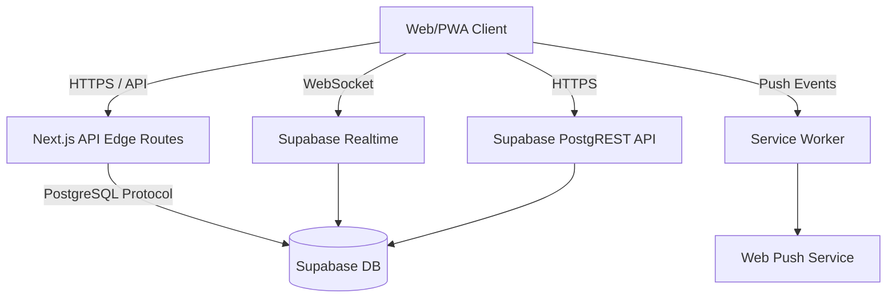
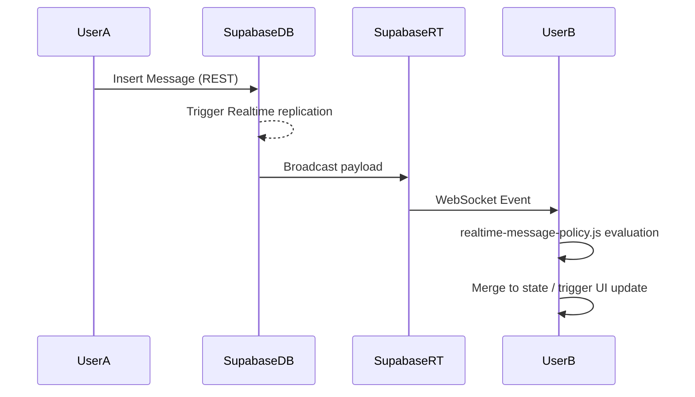

# SpreadZ: Technical Architecture & Engineering Documentation

This document outlines the technical architecture, data flows, and complex engineering systems underlying **SpreadZ**. It is intended for senior engineering staff to understand the internal mechanisms, trade-offs, and design patterns employed in the application.

## 1. Overall System Architecture

SpreadZ is built on a modern, edge-capable stack prioritizing real-time data delivery and high-performance client-side interactions.

*   **Frontend**: Next.js 14 (App Router) with React, leveraging extensive client-side rendering for complex interactions and gestures.
*   **Backend**: Next.js Edge API routes and Supabase backend-as-a-service.
*   **Database**: PostgreSQL (hosted by Supabase) heavily augmented with Row Level Security (RLS) and custom Remote Procedure Calls (RPC).
*   **Real-time Layer**: Supabase Realtime (WebSockets) for presence, typing indicators, and live data streaming.
*   **PWA & Background**: Custom Service Workers (`public/sw.js`, `public/push-worker.js`) handling Web Push Notifications and offline routing.



## 2. Frontend Architecture and State Management

The frontend architecture heavily diverges from standard Next.js structural patterns in favor of a highly interactive, monolithic chat interface.

### The Monolith: `app/chat/page.tsx`
The primary application loop exists within `app/chat/page.tsx`, a massive (~5000 line) monolithic component. This deliberate tradeoff groups state, rendering, physics calculation, and real-time subscriptions together to avoid prop-drilling and React Context overhead in a high-frequency update loop.

**Key State Managers:**
*   **Gestures & Physics**: Uses native touch events (`touchstart`, `touchmove`, `touchend`) combined with `requestAnimationFrame` to build a custom room-swiping engine rather than relying on native CSS scroll snapping. The physics logic calculates velocity (`dragVelocityYRef`) and offsets (`dragOffsetYRef`) to smoothly translate rooms via 3D transforms (`translate3d`).
*   **Real-time Subscriptions**: Multiple parallel channels are maintained simultaneously:
    *   `rooms-realtime`
    *   `messages-realtime`
    *   `mutes-realtime`
    *   `friend-requests-realtime`
    *   `room-presence-[id]`
*   **Content Injection**: The chat input is a `contenteditable` div with custom logic to handle paste events, clamp text (`MESSAGE_MAX_LENGTH`), and enforce programmatic caret positioning.

## 3. Backend Architecture and API Flow

Backend logic is split between Supabase PostgreSQL (handling data persistence, RLS, and triggers) and Next.js Edge API routes (handling external service integrations).

*   **`app/api/admin-auth/route.ts`**: Provides administrative access overrides using hardcoded environment secrets.
*   **`app/api/send-push/route.ts` & `app/api/broadcast-push/route.ts`**: Implements Web Push protocol utilizing VAPID keys, mapping user IDs to stored push endpoints in the DB, and dispatching payloads asynchronously.
*   **`app/api/seeding/route.ts`**: Facilitates automated engagement generation via simulated user activity.

## 4. Database Structure, Schemas, and Relationships

The database is PostgreSQL, strictly defined in `lib/database.types.ts` and managed via `.sql` migrations (e.g., `sql/db_cleanup.sql`).

**Core Tables:**
*   `users`: Stores user identity, `uuid`, display name, college metadata, and avatars.
*   `rooms`: Represents chat environments (`id`, `headline`, `message_count`).
*   `messages`: The core payload table linked to `rooms` and `users`.
*   `mutes`: A pairwise relation table mapping `muter_id` to `muted_id` to filter out toxic users.
*   `user_behaviour`: Tracks high-fidelity interaction telemetry (`seconds_spent`, `messages_sent`, `returned_to_room`).

**Advanced DB Constructs:**
*   **RPCs**: Functions like `increment_behaviour_messages_sent` are utilized to update counters safely without fetching, mutating, and rewriting data from the client, avoiding race conditions.
*   **pg_cron**: Utilized for background maintenance tasks directly at the DB level, such as the `friends_auto_decline` cron job.

## 5. Authentication and Authorization

*   **Authentication**: Initially leverages Supabase Anonymous Auth (`signInAnonymously`). The persistent `uuid` is cached in `localStorage` (`spreadz_user_uuid`) to survive session resets.
*   **Authorization (RLS)**: Row Level Security is the primary authorization barrier.
    *   Example from `sql/db_cleanup.sql`:
        ```sql
        create policy messages_insert_own on public.messages for insert with check (user_uuid = auth.uid());
        ```
    *   **Mutes Isolation**: Muted messages are excluded directly at the DB level via complex RLS policies ensuring clients never download payloads from muted users.

## 6. AI Models, Recommendation Logic, and Personalization

### The Friday Engine (`lib/friday.ts`)
"Friday" is the internal codename for the engagement and ranking algorithm. Rather than relying purely on chronological sorting, SpreadZ calculates a personalized room score based on client-side telemetry.

**Ranking Algorithm:**
```typescript
score = (time_spent * 0.4) + (messages_sent * 0.3) + (returns * 0.2)
```
This forces highly engaging rooms to the top of the feed based on actual user interaction rather than static metadata.

## 7. Background Jobs, Queues, and Real-Time Systems

*   **Real-time Streaming**: Utilizes Supabase Realtime (Elixir-based WebSockets). Policy routing is implemented locally via `app/chat/realtime-message-policy.js` to determine if a broadcast message belongs to the current user (optimistic deduplication), a known room, or should trigger a system notification.
*   **Service Workers**: The `push-worker.js` handles background payloads for offline notifications and routes `notificationclick` events appropriately, either focusing an existing client window or spawning a new one.



## 8. Security, Validation, and Rate Limiting

*   **Data Validation**: Pushed heavily to the database layer via constraint checks and type casting.
*   **Anti-Spam/Abuse**: Handled peer-to-peer via the `mutes` table and `reports` table.
*   **Administrative Security**: Specific routes (like seeding or global broadcasting) require strict validation against an `ADMIN_SECRET_KEY`.
*   **History Manipulation Protection**: A custom hook (`useBackFeedbackIntercept.ts`) pushes synthetic history states (`#back-[timestamp]`) into the browser history API to trap Android hardware back-button gestures, replacing exit events with feedback modals.

## 9. Performance and Scalability Considerations

**Optimizations:**
*   **Message Virtualization strategy**: `page.tsx` limits rendering to active sets (`visibleMessageIds`) rather than mounting the full historical DOM.
*   **CSS Hardware Acceleration**: Room panels utilize `will-change: transform` and `translate3d` to offload paint operations to the GPU during gesture interactions.

**Scalability Bottlenecks:**
*   **Monolithic Component Reflow**: Due to `page.tsx` size, React reconciliation cycles could become expensive if state granularity isn't managed perfectly.
*   **Anonymous Auth Growth**: Unbounded anonymous user creation could lead to database bloat over time without a reaping strategy for inactive identities.
*   **Connection Limits**: High concurrent user counts will stress PostgreSQL connection pools and Realtime node limits.

## 10. Complex Engineering Decisions and Tradeoffs

1.  **Custom Touch Physics over Native CSS**: Implementing custom touch tracking via JavaScript is computationally heavier than native CSS scroll snapping, but allows for precise velocity detection, custom spring animations, and programmatic interruptions (e.g., aborting a swipe mid-gesture).
2.  **Client-Side Event Aggregation**: `user_behaviour` tracking triggers multiple small RPC calls. A queue/batching system might be required in the future to prevent overwhelming the network with analytics beacons.

## 11. Testing, Observability, and Logging

*   **Observability**: Primarily relies on console telemetry and Supabase dashboard metrics. Heavy client-side console logging exists for critical flows (e.g., `[back-intercept]`).
*   **Error Handling**: Silent fallbacks are employed extensively (e.g., catching Giphy API failures gracefully in `fetchGifResults`).

## 12. Current Technical Limitations and Future Challenges

*   **State Management Tech Debt**: Extracting state machines out of `app/chat/page.tsx` into smaller, atomic hooks or a specialized store (like Zustand) will be necessary to maintain developer velocity.
*   **Message Delivery Guarantees**: Currently, if a WebSocket drops, missing messages require a hard reload to reconcile state. A resilient event-sourcing or gap-filling sync protocol is needed.
*   **Database Cleanup Strategy**: Relying solely on `pg_cron` for cleanup (like declining friends) might face lock contention as table sizes scale. Background workers may need to be migrated to a dedicated messaging queue system.
